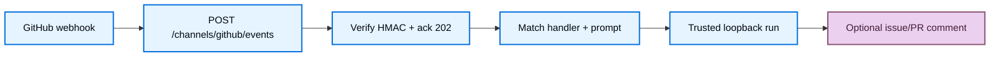

import ManagedDeepAgentsPrivateBetaNote from '/snippets/langsmith/managed-deep-agents-private-beta-note.mdx';
import ManagedDeepAgentsTestAndDeploy from '/snippets/langsmith/managed-deep-agents-test-and-deploy.mdx';

The GitHub channel lets a GitHub App send webhooks to your Managed Deep Agent. You declare **handlers** under `channels/` (event filter + `prompt`), point the App webhook at your deployment, and the runtime verifies signatures, runs the agent, and can auto-reply as a pull request or issue comment.

<Note>
<ManagedDeepAgentsPrivateBetaNote />
</Note>

For the channel model and current limits, see [Channels](/langsmith/managed-deep-agents-channels).

This page covers the **channel** (conversation ingress/egress). Use the [GitHub connector](/langsmith/managed-deep-agents-connectors/github) for sandbox checkouts, or Connect-with-GitHub under [identity](/langsmith/managed-deep-agents-identity) for user OAuth.

## Prerequisites

- A Managed Deep Agents project with a root [identity](/langsmith/managed-deep-agents-identity) declaration (`channels/` requires identity).
- A [GitHub App](https://docs.github.com/en/apps/creating-github-apps/about-creating-github-apps/about-creating-github-apps) you control (customer-brought App), installed on the target org or repos.
- Deploy or local Agent Server URL for the webhook (after first deploy, copy it from the LangSmith deployment dashboard).

## Add a GitHub channel

Add `channels/github.py` or `channels/github.ts` next to your agent entry. The file name becomes the channel name (`github` → `POST /channels/github/events`). Export a named `channel` created with `define_github_channel` / `defineGitHubChannel`.

Handlers are ordered: the first match for a delivery wins. Each handler needs `on` and a `prompt` callback that builds the **human message** for that turn. The agent system prompt remains `instructions.md`.

<CodeGroup>

```python channels/github.py
from managed_deepagents.channels.github import define_github_channel

channel = define_github_channel(
    handlers=[
        {
            "on": "pull_request.opened",
            "repositories": ["acme/api"],  # optional; omit = any repo
            "auto_reply": True,  # default; comment when address is owner/repo#N
            "prompt": lambda event: (
                f"Review {event['repository']}#"
                f"{event.get('issue_or_pull_number')}: "
                f"{event['payload']['pull_request']['title']}"
            ),
        },
    ],
)
```

```ts channels/github.ts
import type { PullRequestOpenedEvent } from "@octokit/webhooks-types";
import { defineGitHubChannel } from "managed-deepagents/channels/github";

export const channel = defineGitHubChannel({
  handlers: [
    {
      on: "pull_request.opened",
      repositories: ["acme/api"], // optional; omit = any repo
      autoReply: true, // default; comment when address is owner/repo#N
      prompt(event) {
        // MDA keeps payload untyped — narrow with Octokit in the agent project
        const pr = event.payload as PullRequestOpenedEvent;
        return `Review ${event.repository}#${pr.pull_request.number}: ${pr.pull_request.title}`;
      },
    },
  ],
});
```

</CodeGroup>

Pair with a shared-bot (or equivalent) identity for channel-only installs. The channel actor is the installation/service principal `github-app:<installationId>`, not the pull request author. Replies use the App installation token—Connect-with-GitHub OAuth is not required for this path.

### Event filters (`on`)

Any GitHub webhook event is accepted. Filter with `on`:

| `on` value | Matches |
| --- | --- |
| `"pull_request"` | Any action for that `X-GitHub-Event` |
| `"pull_request.opened"` | Event + `payload.action` |
| `"*"` | Every delivery |

Managed Deep Agents does **not** ship copies of GitHub webhook payload schemas. The envelope passes common routing fields (`eventName` / `event_name`, `action`, `repository`, `issueOrPullNumber` / `issue_or_pull_number`, …) and leaves the verified JSON on `payload` as untyped. In TypeScript, narrow with [`@octokit/webhooks-types`](https://www.npmjs.com/package/@octokit/webhooks-types). In Python, narrow with your own TypedDicts or runtime checks.

### `prompt` vs `instructions.md`

| Source | Role |
| --- | --- |
| `instructions.md` | Agent **system** prompt (shared across turns) |
| Handler `prompt(event)` | **Human** message for that webhook turn (task text) |

## How GitHub webhooks work



1. GitHub POSTs to `https://<agent-server>/channels/github/events` (the file stem `github` becomes the path segment).
2. The runtime verifies `X-Hub-Signature-256` against `GITHUB_WEBHOOK_SECRET`, dedupes on `X-GitHub-Delivery`, and returns HTTP 202.
3. It picks the first matching handler, calls `prompt` to build the inbound text, then invokes the graph over trusted loopback with actor and source-thread identity (`source.provider: "github"`).
4. When the matched handler has `autoReply` enabled and the conversation address is `owner/repo#N`, it posts the agent response as an issue/PR comment with the App installation token. Events without an issue/PR number skip the comment even when `autoReply` is `true`.

LangGraph auth is bypassed only on `POST /channels/{name}/events` so GitHub can deliver without an ingress secret; the loopback invoke still uses `MDA_INGRESS_SECRET`.

## Channel options

Top-level option:

| Option | Default | Meaning |
| --- | --- | --- |
| `handlers` | _(required)_ | Ordered handler list. First match wins. |

Per-handler options (Python / TypeScript):

| Option | Default | Meaning |
| --- | --- | --- |
| `on` | _(required)_ | Event filter: `event`, `event.action`, or `*` |
| `prompt` | _(required)_ | Builds the human message for the agent turn from the webhook envelope |
| `repositories` | _(none)_ | Allowlist of `owner/repo` full names; omit = any repo |
| `auto_reply` / `autoReply` | `true` | Post the agent response as an issue/PR comment when addressable |

Compile extracts only `{ on, repositories, autoReply }` into the deploy manifest. Live `prompt` callbacks stay on the imported channel module.

## Required secrets

Put these in the project `.env` (or LangSmith workspace secrets) before `mda deploy`. Deploy preflights each channel’s `requiredEnv` from the compiled manifest.

| Variable | Required | Role |
| --- | --- | --- |
| `GITHUB_WEBHOOK_SECRET` | Yes | Verifies `X-Hub-Signature-256` |
| `GITHUB_APP_ID` | Yes | App id for JWT minting |
| `GITHUB_APP_PRIVATE_KEY` | Yes | PEM private key for the App |
| `GITHUB_INSTALLATION_ID` | Yes | Installation the channel acts as (single-install) |
| `MDA_INGRESS_SECRET` | Yes when identity uses trusted loopback / `trusted_backend` | Trusted invoke from the Events path into the graph |

## Configure the GitHub App

1. Create a GitHub App (or reuse one you control) with permissions implied by your handlers (at minimum `metadata:read`; `issues:write` and `pull_requests:read` when any handler has `autoReply` enabled). Tighten App permissions in GitHub settings to match what you actually use.
2. Subscribe the App to the webhook events your handlers need (for example `Pull request` for `pull_request.opened`, or broader events if you use `"*"` / event-level filters).
3. Set the webhook URL to `https://<agent-server>/channels/github/events` and configure the webhook secret as `GITHUB_WEBHOOK_SECRET`.
4. Install the App on the target org or repositories and copy the installation id into `GITHUB_INSTALLATION_ID`.
5. Copy the App id and private key into `GITHUB_APP_ID` and `GITHUB_APP_PRIVATE_KEY`.

## Deploy and smoke-test

1. Put GitHub App secrets in `.env` and ensure [identity](/langsmith/managed-deep-agents-identity) is declared.
2. Run `mda deploy` (or `mda dev` with a reachable webhook URL).
3. Trigger a matching webhook (for example open a pull request on an allowed repository).
4. Confirm the agent run appears in LangSmith and, when `autoReply` is `true` and the event has an issue/PR number, a comment appears.

<ManagedDeepAgentsTestAndDeploy />

## Troubleshooting

| Symptom | Likely cause |
| --- | --- |
| Webhook deliveries fail signature checks | Wrong `GITHUB_WEBHOOK_SECRET`, or body was rewritten before verification |
| Events ACK but agent never runs | Missing `MDA_INGRESS_SECRET`, no handler matched (`on` / `repositories`), or `prompt` returned empty text |
| Deploy fails citing GitHub secrets | `channels/` GitHub channel present but App env vars missing from `.env` / workspace secrets |
| Auto-reply skipped | Handler `autoReply` is `false`, event has no issue/PR number, missing App JWT/installation credentials, or App lacks comment permissions |
| Double comments on Host | Delivery dedupe is process-local; GitHub retries can double-invoke on multi-replica Host |

## Next steps

<CardGroup cols={2}>
  <Card title="Channels" icon="messages" href="/langsmith/managed-deep-agents-channels">
    See how channel discovery and Events ingress work.
  </Card>
  <Card title="Slack" icon="brand-slack" href="/langsmith/managed-deep-agents-channels/slack">
    Add a Slack Events channel alongside GitHub.
  </Card>
  <Card title="Identity" icon="fingerprint" href="/langsmith/managed-deep-agents-identity">
    Choose identity presets for channel callers.
  </Card>
  <Card title="Deploy an agent" icon="upload" href="/langsmith/managed-deep-agents-deploy">
    Route secrets and deploy the channel-enabled agent.
  </Card>
</CardGroup>
