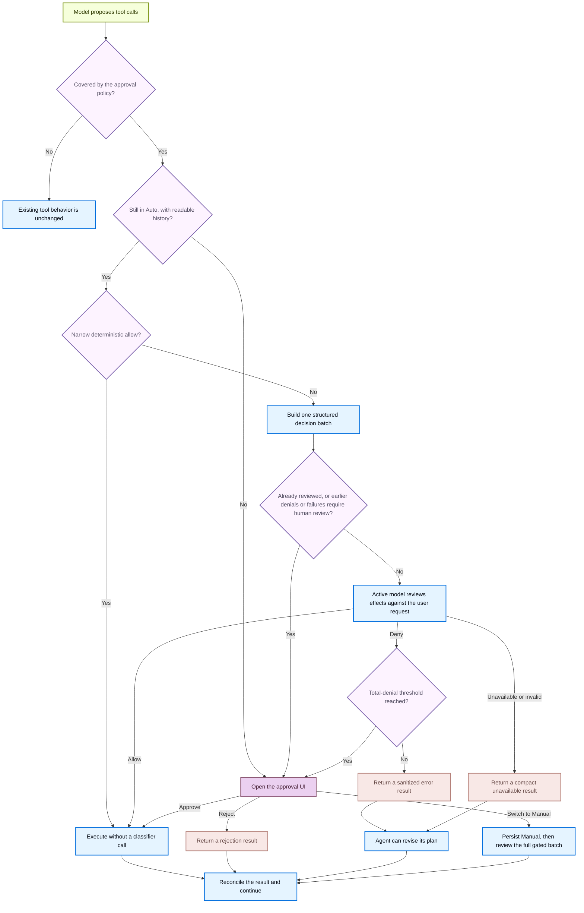

By default, Deep Agents Code asks for your approval before running potentially consequential actions. These are called **gated actions** and include things like:

- Editing or deleting files (`write_file`, `edit_file`, `delete`)
- Running shell commands (`execute`)
- Making web requests (`web_search`, `fetch_url`)
- Delegating work to subagents (`task`)

Read-only tools such as `ls`, `read_file`, `glob`, and `grep` always run without prompting. Approval modes let you choose how much oversight each session requires for the gated actions.

## Choose a mode

| Mode | What it does |
|---|---|
| **Manual** (default) | Asks for approval before every gated action |
| **Auto** | Approves routine actions automatically; asks the model to review anything uncertain; falls back to you after repeated denials or failures |
| **YOLO** | Runs gated actions with no review at all |

Toggle between Manual and Auto at any time during a session with `Shift+Tab` or `Ctrl+T`. YOLO cannot be entered through the keyboard toggle.

<Warning>
    Auto is an authorization heuristic for a local coding agent. It is **not** sandbox containment, an operating-system boundary, or a guarantee that model-generated actions are safe.
</Warning>

## Enable Auto

Auto is an experimental beta. To use it, set the opt-in flag and then choose Auto for your session.

<Steps>

    <Step title="Set the experimental opt-in" icon="key">
        Add the environment variable to your shell or `~/.deepagents/.env`:

        ```bash
        export DEEPAGENTS_CODE_EXPERIMENTAL=1
        ```
    </Step>

    <Step title="Launch with Auto" icon="terminal">
        ```bash
        dcode -y
        ```

        Or set it as your default in `~/.deepagents/config.toml`:

        ```toml
        [startup]
        mode = "auto"
        ```

        You can also toggle Auto on and off mid-session with `Shift+Tab` or `Ctrl+T`.
    </Step>
</Steps>

If Auto is requested without the experimental opt-in, or in a sandboxed session, it falls back to Manual with a warning.

## Enable YOLO

YOLO runs gated actions without any review. Use it only when you accept that the agent can take any action without asking.

<Steps>

    <Step title="Launch with YOLO" icon="terminal">
        ```bash
        dcode --yolo
        ```

        Accept the one-time risk acknowledgement when prompted. The acknowledgement is stored locally so you do not see it again on later launches.

        Or set it as your default in `~/.deepagents/config.toml`:

        ```toml
        [startup]
        mode = "yolo"
        ```
    </Step>
</Steps>

A session launched in YOLO moves to Manual when you press `Shift+Tab` or `Ctrl+T`. You cannot switch back to YOLO with the keyboard toggle.

## How Auto works

Auto keeps the same gated-action rules as Manual but changes how those actions are reviewed. It uses two stages:

1. **Routine actions run automatically.** A write to a source file like `src/parser.py` or a read-only Git command like `git status` proceeds without a prompt. Sensitive targets like `.github/workflows/ci.yml` or mutating commands like `git commit` go to the next stage.
2. **The model reviews the rest.** For anything not clearly routine, the active model checks whether the action matches what you asked for. Only your literal prompt can authorize an action. If the model denies a call, the agent gets an error result and can revise its plan.

After repeated denials or classifier failures, Auto stops and shows you the normal approval prompt for the next batch, then continues in Auto mode.

<Accordion title="Auto decision flow" icon="flow">


</Accordion>

### Revalidate before side effects

The decision plan is bound to the thread, mode, batch, and exact gated calls. Missing or invalid state, a mode race, or a replay falls back to human review. For example, if you switch to Manual while classifier review is in progress, an earlier Auto decision cannot execute silently; the normal approval UI opens instead.

### Understand scope and limitations

- The Manual approval menu can enable Auto for the current thread. Threshold fallback can switch permanently to Manual or perform a one-off review while leaving Auto enabled.
- The active model is not an independent security authority. [MCP read-only annotations](/oss/deepagents/code/mcp-tools#read-only-tool-annotations-in-auto-mode) are trusted as a deliberate beta tradeoff.
- Parent-level Auto review does not cover actions performed inside delegated subagents or broader explicitly configured `js_eval` fan-out. Model providers and tracing backends may still observe classifier inputs and outputs even though the TUI hides them.

## Where Auto and YOLO are available

Auto and YOLO are interactive-mode features. They are not available in non-interactive mode (`-n` or piped stdin) or in ACP server mode. Headless runs use fail-closed MCP routing and `--shell-allow-list` for shell access.

Auto also falls back to Manual when:

- `DEEPAGENTS_CODE_EXPERIMENTAL=1` is not set.
- A remote `--sandbox` is active (Auto is for unsandboxed local sessions only).

## Reference

### Flag and config precedence

`--yolo` takes priority over `-y`/`--auto-approve`, which takes priority over `[startup].mode`.

| Source | Value | Selects |
|---|---|---|
| `--yolo` | flag | YOLO (interactive only, after acknowledgement) |
| `-y`, `--auto-approve` | flag | Auto (requires `DEEPAGENTS_CODE_EXPERIMENTAL=1`) |
| `[startup].mode` | `"manual"` | Manual |
| `[startup].mode` | `"auto"` | Auto |
| `[startup].mode` | `"yolo"` | YOLO |
| `Shift+Tab`, `Ctrl+T` | toggle | Manual and Auto (never enters YOLO) |

## See also

- [CLI reference](/oss/deepagents/code/cli-reference)
- [Configuration](/oss/deepagents/code/configuration)
- [Remote sandboxes](/oss/deepagents/code/remote-sandboxes)
